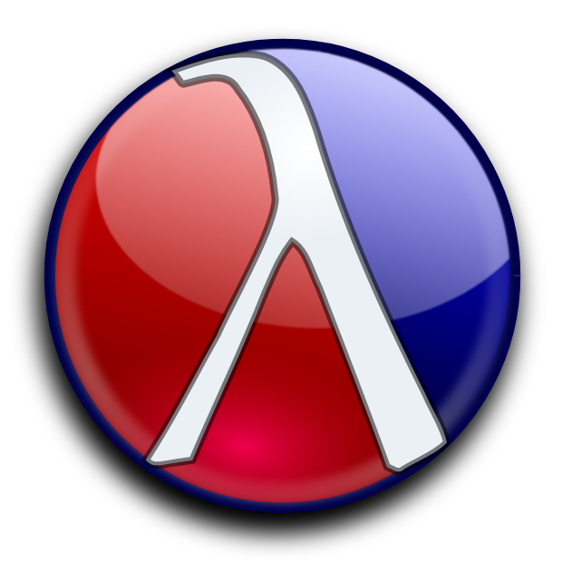

# Racket Nike

Um sistema em Racket para explorar opções de tênis, feito para estudo. 


## Como Usar

### Pré-requisitos
- Racket instalado no sistema ([Download aqui](https://racket-lang.org/))

### Executando o Programa

1. **Navegue até o diretório do projeto:**
   ```bash
   cd /caminho/para/racket
   ```

2. **Execute o arquivo principal:**
   ```bash
   racket tenis-clean.rkt
   ```

3. **Use o menu interativo:**
   - Digite `(main-menu)` para acessar o menu completo
   - Digite `(demo)` para uma demonstração rápida


### Funções Disponíveis

```racket
;; Exibir todos os tênis
(display-all-sneakers)

;; Buscar tênis por nome
(find-sneaker "Air Max")

;; Exibir estatísticas
(display-stats)

;; Menu interativo
(main-menu)

;; Demonstração rápida
(demo)
```

## Estrutura do Código

- **Struct `sneaker`**: Estrutura de dados para cada tênis
- **Base de dados**: Lista com todos os modelos
- **Funções de busca**: Filtros por nome e década
- **Interface**: Menu interativo e funções de exibição

